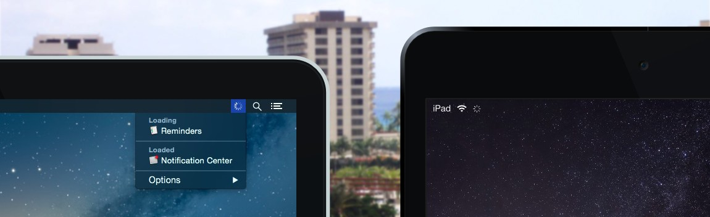

<b>Loading</b> See when Mac apps are using your network

Similar to the network activity indicator on iOS, Loading shows a spinning progress wheel in your menu bar when your network is being used. Clicking the icon shows the apps that are using your network, and holding down the option key shows the individual processes.

The original project required OS X 10.7 or newer, but that was only because it used 10.7's NSPopover for the licensing functionality. Support for older versions of OS X remains untested.

* * *

Most of the functionality in this app was reverse-engineered from the private NetworkStatistics framework found here:

    /System/Library/PrivateFrameworks/NetworkStatistics.framework

And it uses the private `[NSStatusBarButtonCell _button]` selector on OS X 10.9 and earlier, as `[NSStatusBarButtonCell button]` was not available until Yosemite.

* * *

Lastly, OS X has a large number of bugs regarding NSMenus:

- `[NSMenuItem setView:]` is currently broken, as it will cause the keyboard controls to stop working after using the menu for the first time.

- Using setView on an NSTextView to have wrapped text causes the selection background to render incorrectly, ignores the first mouse click on the menu item, and has the same broken keyboard controls as above. The workaround was to wrap the text using `CTFramesetter` and `\n` newlines.

- NSStatusItem's menu will be drawn in the wrong position if you follow the recommended behavior of using `[NSMenuDelegate menuNeedsUpdate:]` OR `menu:updateItem:atIndex:shouldCancel:`. The only workaround I was able to find was swizzling `[NSStatusBarButtonCell trackMouse:inRect:ofView:untilMouseUp:]` and updating the menu there.

- NSMenuItems with attributed titles cannot be updated when the item is selected or deselected, so you can't for example have a gray menu item that turns white when selected. Since the icons can be updated in the select/deselect event for some reason, one proposed workaround is to render the text into a large NSImage and set that as the icon for the menu item.

- the NSMenuItem checked state can be modified when selected or deselected, but it causes the entire menu to flicker and redraw improperly.

- [NSMenuItem setMixedStateImage:] has been available since 10.0 and has not been deprecated, but *has never actually done anything*.

- "Cocoa" NSMenus are actually built entirely on Carbon, and even the Apple menu items are subclassed directly from `IBCarbonMenuItem`, but in 64-bit mode `kEventParamMenuContextHeight` is always 0.0 in both draw events. This is needed to flip the coordinate system on the CGContextRef for drawing into the menu (the alternative of using GetPortBounds is only available in 32-bit mode), so without it the feature seems useless? Combine that with the setView bugs and I have no clue how they're drawing the `1 new` text next to the App Store menu item.

* * *

**Website**  
http://bonzaiapps.com/loading/

**Download**  
http://bonzaiapps.com/loading/Loading.zip

**Language**  
English, Français, Deutsch, 汉语, 漢語, 日本語, Español, Italiano, Nederlands, 한국어, Português, Dansk, Suomi, Norsk bokmål, Svenska, Pу́сский, Polski, Türkçe, العربية, ภาษาไทย, Čeština, Magyar, Català, Hrvatski, Ελληνικά, עברית, Român, Slovenský jazyk, Yкраїнська мова, Bahasa Indonesia, Bahasa melayu, Tiếng việt
